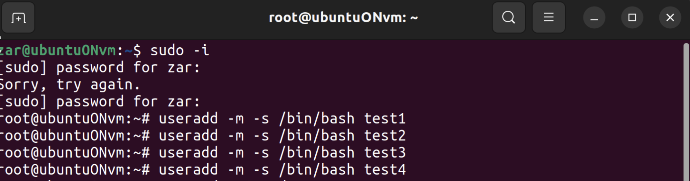

# Задание 1: Создание пользователей

## Цель задания
Создать четырех пользователей: test1, test2, test3, test4.

## Ход работы

### Переход в режим root
```bash
sudo -i
# или
su -
```
Для создания нового пользователя использую команду `useradd` с флагом `-m` для наличия домашнего каталога у пользователя, `-s` исполтзуется для определения оболочки командной строки, в моем случае я указала bash

