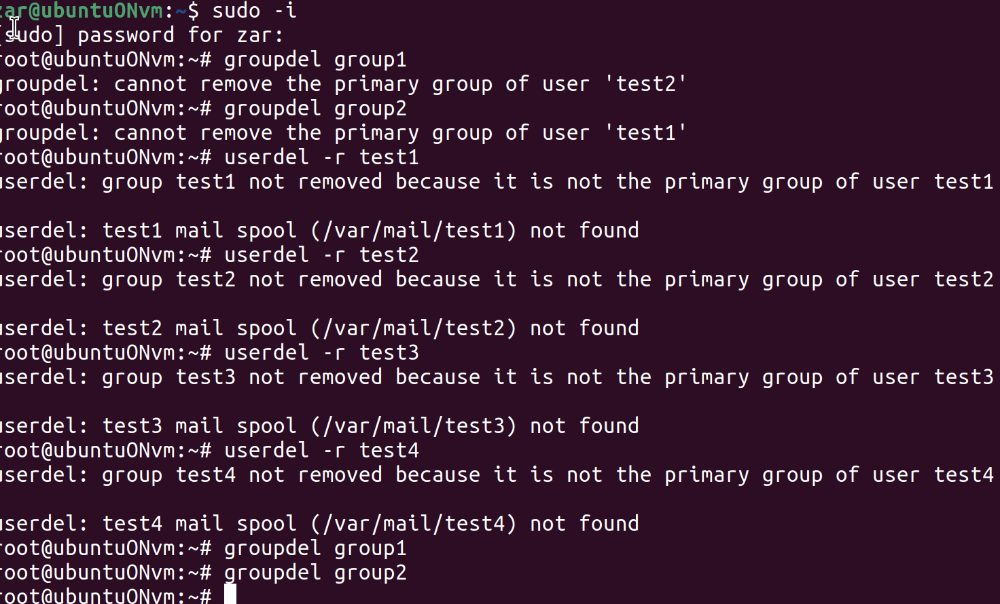

# Задание 10: Удаление учетных записей

## Цель задания
Удалить всех созданных пользователей и группы.

## Ход работы

```bash
groupdel имя_группы
userdel имя_пользователя
```
Видим, что нельзя удалить группу, пока она является основной для какого-нибудь пользователя.

