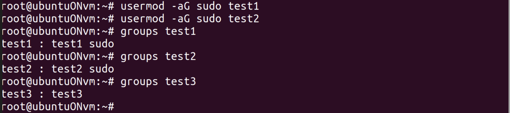

# Задание 2: Полномочия root

## Цель задания
Настроить полномочия root для пользователей test1, test2

## Ход работы

Для создания нового пользователя использую команду `usermod` с флагом `-aG` для добавления пользователя в группу sudo, т.е SuperUser DO / substitute user do для того, чтобы у пользователей были права root

