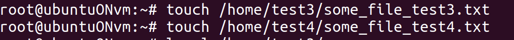

# Задание 3: Создание файлов у пользователей

## Цель задания
Создать файлы в домашних каталогах пользователей test3, test4

## Ход работы

### Создание файлов
```bash
touch /каталог, где будет лежать файл
```
Оставаясь пользователем root, создаю файлы в указанных местах - домашних каталогах пользователей test2 и test3



Проверим наличие, созданных файлов

