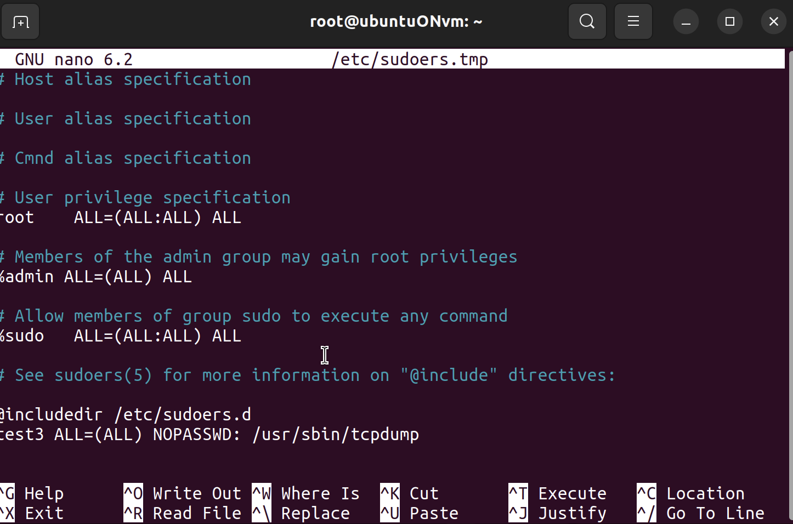
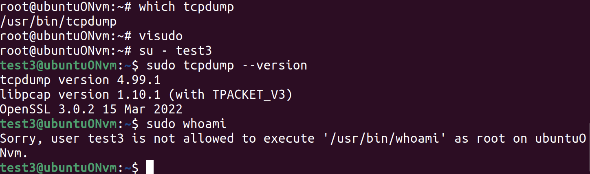

# Задание 4: Настроить ограниченные полномочия для пользователя test3

## Цель задания
Для пользователя test3 разрешить получение полномочий только для
выполнения команды tcpdump

## Ход работы

Перейдем в файл sudoers.tmp, где можем описать права пользователей



Добавим строку, которая позволит выполнять только команду tcpdump без пароля

```bash
test3 ALL=(ALL) NOPASSWD: /usr/sbin/tcpdump
```

Проверим на команде `tcpdump --version` и `whoami`



Чтобы узнать, где находиьтся эта командля использовали `which tcpdump`