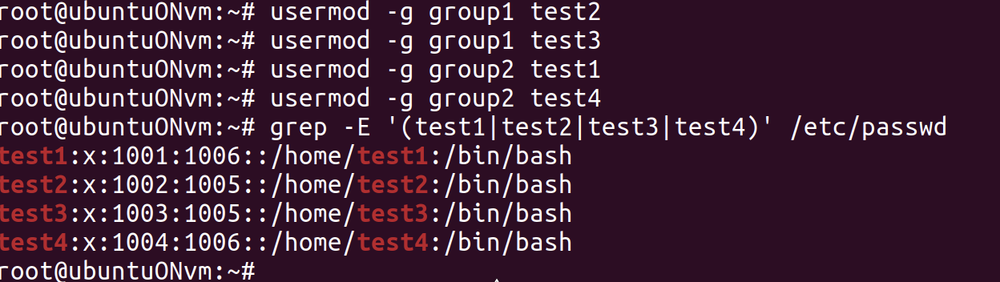

# Задание 6: Назначение групп

## Цель задания
Назначить основные группы пользователям

## Ход работы

### Создание группы
```bash
usermod -g имя_группы имя_пользователя
```
С помощью команды, предназначенной для изменения параметров пользователя и опции `-g` можем назначить основную группу для пользователя.
Информация о пользователях хранится в файле /etc/passwd, где можно посмотреть основные группы пользователей, так и сделаем, чтобы проверить: видим, что четвертая колонка указывает номера соответвующим парам, которые были объеденины в группы.


