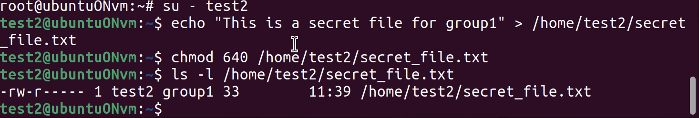
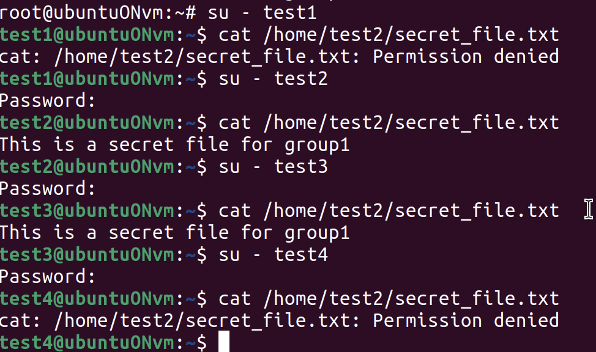

# Задание 8: Настроить права доступа к файлам между группами

## Цель задания
Под пользователем test2 создать файл. Настроить права доступа к файлу —
для группы group1 – чтение, для группы group2 — запретить чтение, запись и
исполнение.

## Ход работы

### Переход в режим root
```bash
chmod 640 /home/test2/secret_file.txt 
```

Создаём файл от имени test2: для этого сменим пользователя. Настраиваем права доступа с помощью chmod, владелец (test2)имеет стандартные права, а это чтение и запись rw- = 6. Группа group1 имеет только чтение (r-- = 4). А остальным (включая group2) запрещаем всё (--- = 0).

Посмотрим, что всё установилось правильно через команду `ls -l /home/test2/secret_file.txt`



Проверим теперь с помощью действий с этим файлом разными пользователями. Видим, что участникам группы group1 и test2 можно посмотреть содержимое, а остальным нет.

