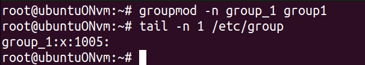
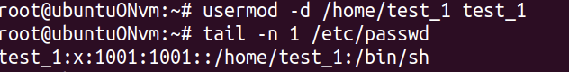
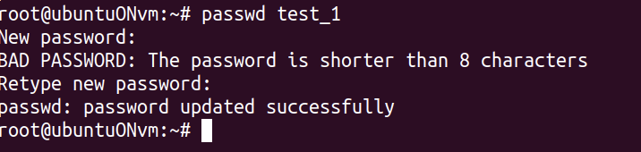

# Задание 9: Изменение учетных записей

## Цель задания
Попрактиковаться в изменении пароля, имени пользователя и групп

## Ход работы

### Изменение параметров
```bash
usermod -l новое_имя старое_имя
groupmode -m новое_имя старое_имя
```




Можно заметить, что домашний каталог пользователя не изменился, чтобы его изменить используем слудующие команды



### Изменение пароля
```bash
passwd имя_пользователя
# или если сам пользователь меняет
passwd
```

