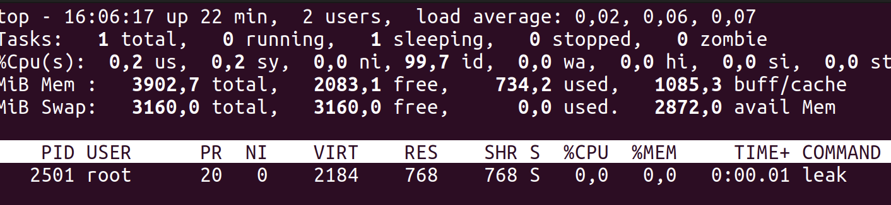
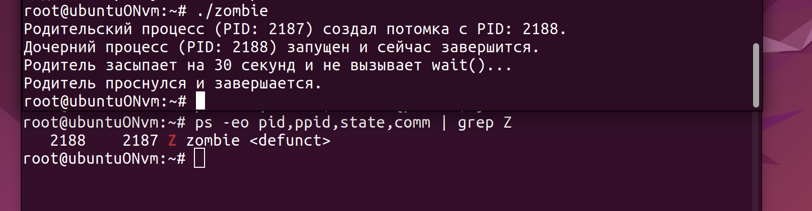
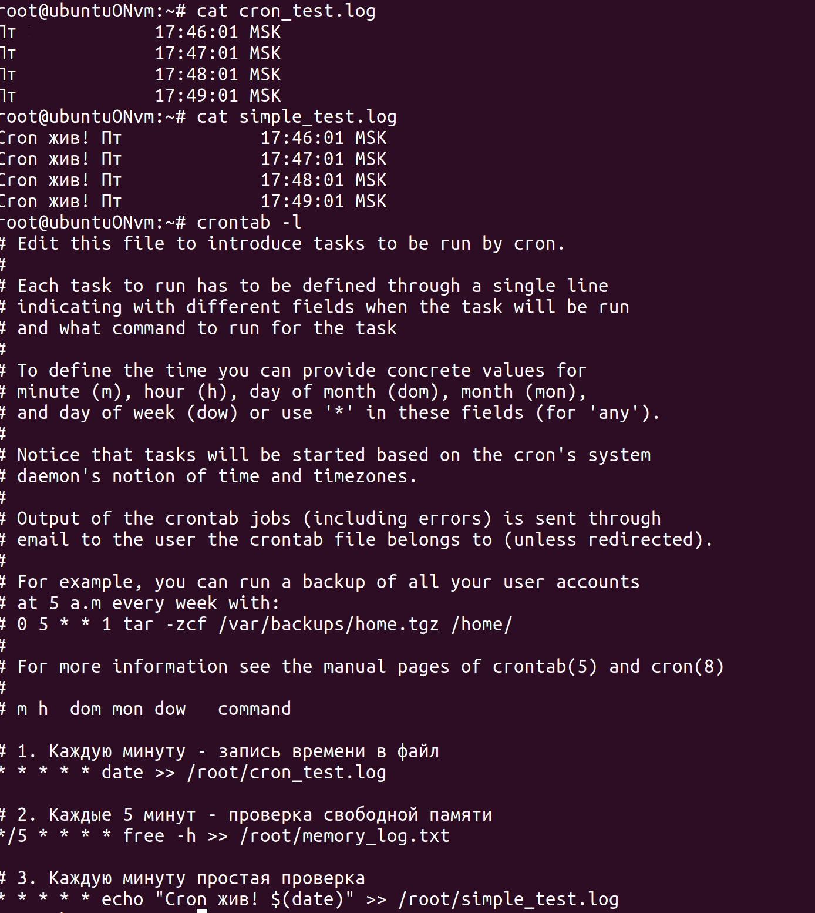
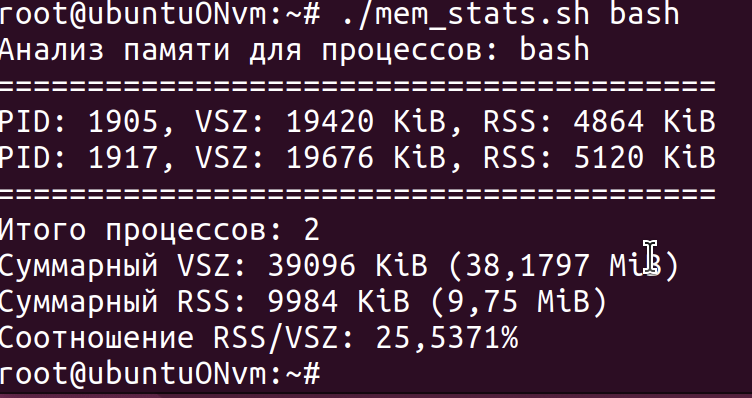
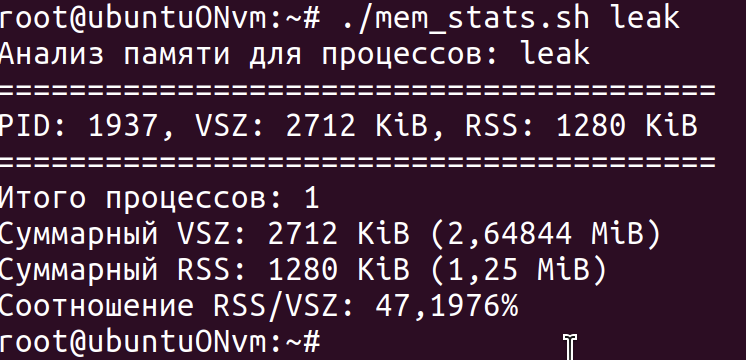

# Лабораторная работа 2: Мониторинг процессов и планирование задач

## Цель работы
Изучить методы мониторинга системных процессов, выявления проблем с памятью и настройки автоматического выполнения задач

## Ход работы

## 1. Анализ утечек памяти в программах

- Напишите программу, в которой существует “утечка памяти”
- Проследите за работой программы с помощью команды ps или top, обращая внимание на показатели использования памяти

Напишем простую программу, где будет утечка памяти, т.е выделение динамической памяти без освобождения по завершению работы программы. В нашей программе в цикле будет выделяться 1КБ памяти каждые 2 секунды. 

```c
#include <stdlib.h>
#include <unistd.h>

int main() {
    while(true) {
        malloc(1024); // выделяем память и не освобождаем
        sleep(2);
    }
    return 0;
}
```
Программу написали, далее скомпилируем и посмотрим статистику по работе программы.

```bash
gcc -o leak leak.c
./leak &
top -p PID_процесса # который был получен предыдущей командой
```
Результат работы команды `top -p PID_процесса`




## 2. Создание и наблюдение зомби-процессов 

- Придумайте сценарий, при котором в системе появляется зомби процесс
- Проследите за работой процесса

В Linux процесс-зомби — это процесс, который завершил свое выполнение и был прерван с помощью системного вызова exit(), но все еще имеет свою запись в таблице процессов системы. 

```c
#include <stdlib.h>
#include <unistd.h>
#include <sys/types.h>

int main() {
    pid_t child_pid = fork(); // Создаем дочерний процесс

    if (child_pid == 0) {
        // Дочерний процесс
        printf("Дочерний процесс (PID: %d) запущен и сейчас завершится.\n", getpid());
        exit(0);
    } else {
        // Родительский процесс
        printf("Родительский процесс (PID: %d) создал потомка с PID: %d.\n", getpid(), child_pid);
        printf("Родитель засыпает на 30 секунд и не вызывает wait()...\n");
        sleep(30); // Родитель не забирает статус потомка
        printf("Родитель проснулся и завершается.\n");
    }
    return 0;
}
```

```bash
gcc -o zombie zombie.c
./zombie
# в другом терминале
ps aux | grep Z
```
Результат работы команды `ps aux | grep Z`



## 3. Настройка регулярных заданий через cron 

- Придумайте три задания, которые требуется запускать регулярно
- Составьте crontab-записи для каждого задания и укажите, в какие файлы их необходимо поместить


Добавим личные cron-задания командой `crontab -e`, не изменяя системный файл /etc/crontab.

Проверим, введя команду `crontab -l`




## 4. Разработка bash-скриптов для анализа памяти 

- Напишите простой bash-сценарий обработки вывода команды ps для определения суммы значений в столбцах VSZ и RSS для процесса, выполняющегося в системе. 
- Как эти показатели соотносятся с реальным объемом физической памяти и размером раздела подкачки?

```bash
#!/bin/bash

# Проверяем, передан ли аргумент (имя процесса)
if [ $# -eq 0 ]; then
    echo "Usage: $0 <process_name>"
    exit 1
fi

PROCESS_NAME=$1

# Используем ps для получения VSZ и RSS для всех процессов с данным именем
# awk суммирует значения в столбцах 5 (VSZ) и 6 (RSS)
ps -eo vsz,rss,comm | grep "$PROCESS_NAME" | grep -v grep | awk -v proc="$PROCESS_NAME" '
    { total_vsz += $1; total_rss += $2; count++ }
    END {
        if (count > 0) {
            print "Процесс(ы):", proc;
            print "Количество процессов:", count;
            print "Суммарный VSZ (виртуальная память):", total_vsz " KiB";
            print "Суммарный RSS (физическая память):", total_rss " KiB";
            print "Суммарный VSZ (виртуальная память):", total_vsz/1024 " MiB";
            print "Суммарный RSS (физическая память):", total_rss/1024 " MiB";
        } else {
            print "Процесс с именем", proc, "не найден."
        }
    }'
```

### VSZ (Virtual Set Size):
- Общий объем виртуальной памяти, которую процесс запросил у ядра. Сюда входит код, данные, разделяемые библиотеки и память, которая может быть отображена, но еще не загружена в RAM (paged out).
- Эта цифра может быть сильно завышена по сравнению с реальной используемой памятью. Она показывает потенциальный "аппетит" процесса.

### RSS (Resident Set Size):
- Объем физической памяти (RAM), который процесс фактически использует в данный момент. Это часть VSZ, которая находится в оперативной памяти.
- RSS — это то, что действительно "давит" на физическую память. Если сумма RSS всех процессов приближается к объему RAM, система начинает активно использовать раздел подкачки (swap).

### Раздел подкачки (Swap):
- Когда физической памяти не хватает, ядро перемещает неактивные части памяти (страницы) из RAM на диск (в swap). Процесс об этом "не знает".
- VSZ - RSS — это не размер swap, используемый процессом. Это вся память, которая не находится в RAM, включая неинициализированные данные и библиотеки, которые еще не подгружены. Реальный объем swap, используемый процессом, сложно точно определить по этим показателям (для этого есть smem или можно смотреть /proc/<pid>/status).

Посмотрим на результат работы bash-сценария для процесса bash.



Также проверим эту программу на ранее написанных программах с утечкой памяти.

