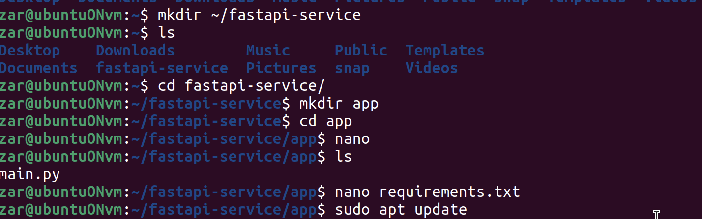
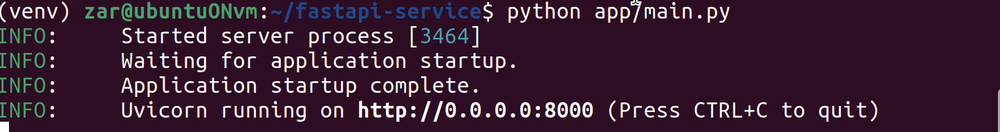
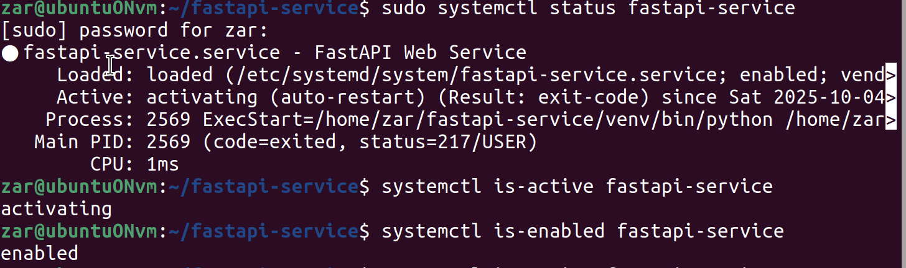
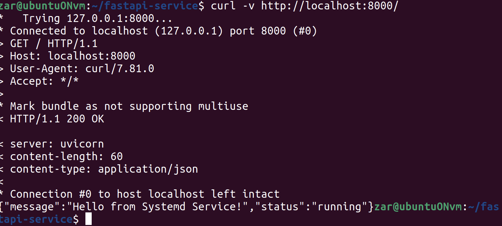

# Лабораторная работа 4: Управление сервисами с Systemd

## Цель работы
Научиться создавать и управлять systemd-сервисами для автоматического запуска и контроля backend-приложений

## Ход работы

## 1. Создание systemd unit-файла для backend-сервиса

Systemd - это современная система инициализации и менеджер сервисов в Linux, который заменяет старую систему SysV init. Он отвечает за запуск, остановку и управление системными сервисами.

Создадим файл app/main.py, где будет простой сервис на FastAPI 

```bash
mkdir fastapi-service
cd fastapi-service
mkdir app
cd app
touch main.py
```

```py
from fastapi import FastAPI
import uvicorn
import time

app = FastAPI(title="Systemd Service Demo", version="1.0.0")

@app.get("/")
async def root():
    return {"message": "Hello from Systemd Service!", "status": "running"}

@app.get("/health")
async def health():
    return {"status": "healthy", "timestamp": time.time()}

if __name__ == "__main__":
    uvicorn.run(app, host="0.0.0.0", port=8000)
```

Также нам понадобится файл с зависимостями requirements.txt для корректной работы и установки требуемых модулей.

```txt
fastapi==0.104.1
uvicorn==0.24.0
```


Также будем работать в виртуальной среде, установим там необходимые нам модули

```bash
sudo apt update
sudo apt install python3 python3-pip python3-venv -y
cd ~/fastapi-service
python3 -m venv venv
source venv/bin/activate
pip install -r requirements.txt
python app/main.py
```



Теперь создадим основсной systemd unit файл

```bash
sudo nano /etc/systemd/system/fastapi-service.service
```
Внутри пропишем

```ini
[Unit]
Description=FastAPI Web Service
After=network.target
Wants=network.target
[Service]
Type=simple
User=ubuntu
Group=ubuntu
WorkingDirectory=/home/ubuntu/fastapi-service
Environment=PATH=/home/ubuntu/fastapi-service/venv/bin
ExecStart=/home/ubuntu/fastapi-service/venv/bin/python /home/ubuntu/fastapi-service/app/main.py
ExecReload=/bin/kill -HUP $MAINPID
Restart=always
RestartSec=5
# Security options
NoNewPrivileges=yes
PrivateTmp=yes
ProtectSystem=strict
ProtectHome=yes
[Install]
WantedBy=multi-user.target
```

- Description - человеко-читаемое описание сервиса
- After=network.target - указывает, что сервис должен запускаться ПОСЛЕ загрузки сети
- Wants=network.target - мягкая зависимость от сети (если сеть не загрузится, сервис все равно запустится)
- Type=simple - сервис является простым приложением (не fork-процессом)
- User и Group - от имени какого пользователя и группы запускать сервис
- WorkingDirectory - рабочая директория при запуске
- Environment - устанавливает переменные окружения
- ExecStart - полный путь к команде запуска
- Restart=always - всегда перезапускать при падении
- RestartSec=5 - ждать 5 секунд перед перезапуском
- NoNewPrivileges=yes - запрещает процессу получать новые привилегии
- PrivateTmp=yes - создает изолированную временную директори
- ProtectSystem=strict - запрещает запись в системные директории
- ProtectHome=yes - делает домашние директории только для чтения

## 2. Настройка автозагрузки сервиса

```bash 
# Даем правильные права на файлы
sudo chmod 644 /etc/systemd/system/fastapi-service.service
# Проверяем синтаксис файла
sudo systemd-analyze verify /etc/systemd/system/fastapi-service.service
sudo systemctl daemon-reload

# Включаем автозапуск сервиса при загрузке системы
sudo systemctl enable fastapi-service

# Запускаем сервис
sudo systemctl start fastapi-service
# Проверяем статус сервиса
sudo systemctl status fastapi-service
```

## 3. Мониторинг и отладка сервиса

```bash
# Детальный статус
sudo systemctl status fastapi-service

# активен или неактивен
systemctl is-active fastapi-service

# Проверка включен ли автозапуск
systemctl is-enabled fastapi-service
```






```bash
# Остановка сервиса
sudo systemctl stop fastapi-service

# Перезапуск сервиса
sudo systemctl restart fastapi-service

# Перезагрузка конфигурации без остановки
sudo systemctl reload fastapi-service
```
